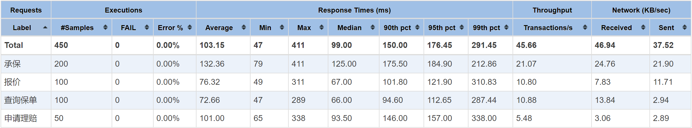

# 压测记录及分析<!-- omit in toc -->

- [1. 第一次](#1-第一次)

## 1. 第一次

系统版本：[Insbiz 1.0.x](../../../../releases/v1.0.x)

服务器：

- 类型：腾讯云轻量应用服务器（单机）
- 系统： CentOS Stream 8 64bit
- CPU：2 核
- 内存：4GB
- 硬盘：80GB SSD 云硬盘
- 带宽：8Mbps

数据库：

- 类型：腾讯云 TDSQL-C MySQL 版（单实例）
- 版本：2.0.21（MySQL 5.7）
- 容量：100G
- CUP：1 核
- 内测：1GB

压测配置：

- 线程数：5
- 循环次数：10

测试报告：

监控指标：均正常

测试结论：初步达标，仍需加量验证
